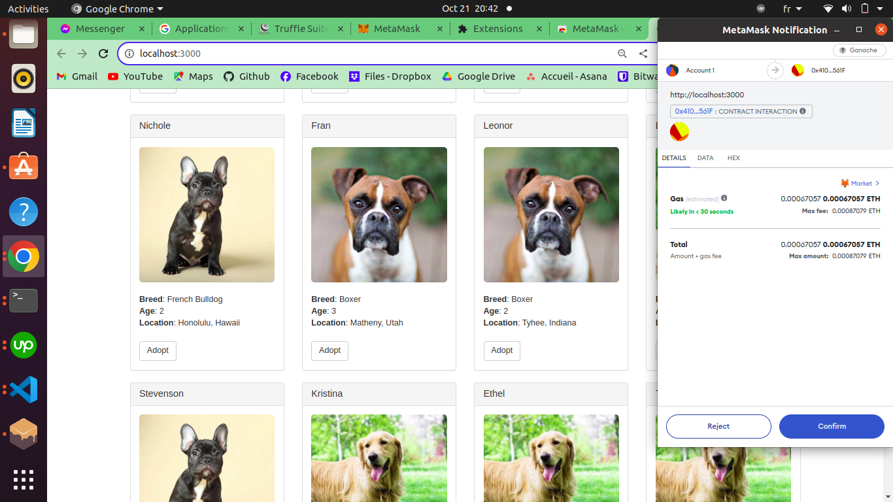

# Ethereum Pet Shop Tutorial - Mini Project

Welcome to the Ethereum Pet Shop mini-project. This project serves as a practical introduction to building decentralized applications on the Ethereum blockchain.

## Overview

This Pet Shop Dapp allows users to adopt pets using Ethereum transactions. It's a simple demonstration of how smart contracts can be used to create interactive applications on the Ethereum platform.

## Demo Video

To see the Dapp in action, please refer to our demo video:
[](demo/pet-shop.mp4)


## Screenshots

For a quick visual overview, we have provided screenshots in the `screenshots` folder. Navigate there to view various stages and functionalities of the Dapp.

## Getting Started

1. **Prerequisites**:
    - Install [Node.js](https://nodejs.org/)
    - Install [Truffle](https://www.trufflesuite.com/truffle)
    - Install [MetaMask](https://metamask.io/) browser extension

2. **Installation**:
    ```
    npm install
    ```

3. **Running the Dapp**:
    ```
    truffle develop
    compile
    migrate
    npm run dev
    ```

   Access the Dapp in your browser, and make sure MetaMask is connected to the appropriate Ethereum network.


